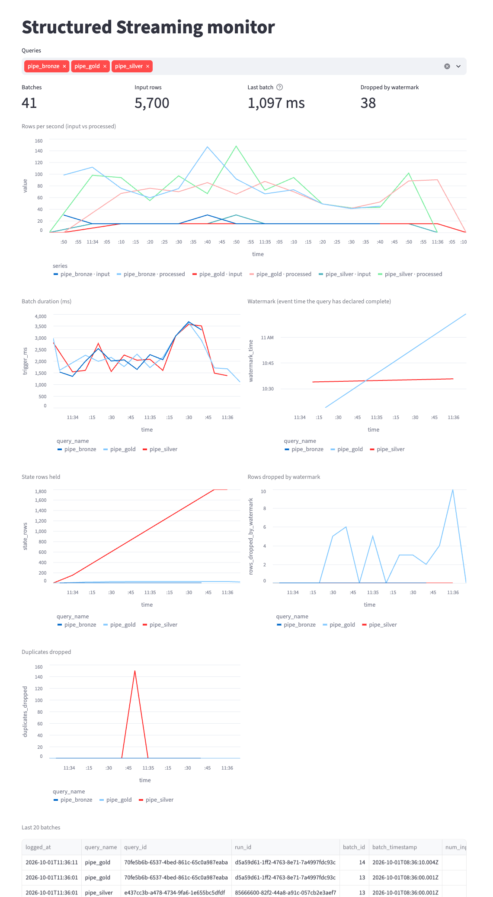

# Stream monitor: `FileMetricsListener` + Streamlit

Companion to section 8 of [`L5_streaming.ipynb`](L5_streaming.ipynb). It explains what the listener
records and how to read every chart of the dashboard, using a real run of the section 8 pipeline.

## `FileMetricsListener`

Spark reports a `StreamingQueryProgress` after every micro-batch of every query. A
`StreamingQueryListener` registered with `spark.streams.addListener(...)` receives those reports on
the driver (section 6 prints them with `SimpleMetricsListener`).

[`FileMetricsListener`](../../pyspark_demo/streaming.py) handles the same events differently:

- `onQueryProgress` appends **one CSV row per micro-batch per query** to
  `data/l5/metrics/progress.csv`. A lock keeps rows from two queries finishing at the same moment
  from interleaving.
- `onQueryStarted` / `onQueryTerminated` still print one line each, so you can see the queries come
  and go in the notebook. The per-batch lines are not printed.
- Batches that find no new data are reported as *idle* (`onQueryIdle`) and are not written.
  Batches that read no rows but still do work, such as closing windows, *are* written, with
  `num_input_rows = 0`.

The columns of `progress.csv`:

| column | from the progress report | meaning |
|---|---|---|
| `query_name`, `query_id`, `run_id` | `name`, `id`, `runId` | which query; `run_id` changes on every restart, `query_id` only with a new checkpoint |
| `batch_id`, `batch_timestamp` | `batchId`, `timestamp` | each query numbers its own batches; the timestamp is when the batch started (UTC) |
| `num_input_rows` | `numInputRows` | rows read from the source in this batch |
| `input_rows_per_sec` | `inputRowsPerSecond` | how fast rows *arrived* since the previous batch |
| `processed_rows_per_sec` | `processedRowsPerSecond` | how fast this batch *processed* them |
| `trigger_ms`, `add_batch_ms` | `durationMs` | total batch time, and the part spent writing to the sink |
| `watermark` | `eventTime.watermark` | the watermark used in this batch (stateful queries only) |
| `state_rows` | `stateOperators[].numRowsTotal` | rows held in state after the batch |
| `rows_dropped_by_watermark` | `stateOperators[].numRowsDroppedByWatermark` | input rows discarded as too late |
| `duplicates_dropped` | `stateOperators[].customMetrics.numDroppedDuplicateRows` | rows removed by `dropDuplicates…` |

## Running the dashboard

From the repo root, in a terminal, **before** the pipeline cell:

```bash
uv run streamlit run labs/L5/monitor_dashboard.py
# another file:  uv run streamlit run labs/L5/monitor_dashboard.py -- --csv path/to/progress.csv
```

Open <http://localhost:8501>. The app rereads the CSV every 2 seconds. Switch off *Auto-refresh* in
the sidebar to freeze the view. *Queries* filters the charts by query. Times on the charts are in
your browser's time zone. The notebook prints UTC.

## A run, chart by chart

The screenshot was taken right after the pipeline cell of section 8 finished:
- 12 rounds of 150 readings, 10 seconds apart;
- 8% of the readings up to 45 minutes late;
- the file of round 6 delivered twice;
- the devices' clock advancing 5 minutes per round.

Your numbers will differ a little, because the generator is random, but the shapes should not.



### The four numbers at the top

- **Batches: 41.** All three queries together: `pipe_bronze` 12, `pipe_silver` 14 and
  `pipe_gold` 15. Silver and gold have more batches than bronze because each layer runs one or two
  batches after the previous one finishes, and gold also runs batches that only close windows.
- **Input rows: 5,700.** The sum over all queries, so each reading is counted once per layer:
  - bronze 1,950 = 12 × 150 + the 150 redelivered;
  - silver 1,950, reading all of bronze;
  - gold 1,800, reading silver after the duplicates are removed.
- **Last batch: 1,097 ms.** The newest row in the CSV: gold batch 14, which read 0 rows and only
  closed windows.
- **Dropped by watermark: 38.** Gold's total. Spark counts this metric *after* the partial
  aggregation, so two late readings for the same device and window count as one. Counted from the
  tables (*Where did silver − gold go?* in section 9), 41 readings were dropped.

### Rows per second (input vs processed)

- **Input** is about **15 rows/s** for every query: 150 readings every 10 seconds.
  - Bronze shows 30 rows/s once, at the batch with 300 rows: round 6 plus its redelivered copy.
  - Silver shows the same jump one batch later.
- **Processed** is 40–150 rows/s, how fast each batch ran once it started.

As long as *processed* stays above *input*, the query keeps up. If *input* stays above *processed*,
the query falls behind and the dashboard shows a warning (Q9c). Every line drops to 0 at the end:
those are the batches that ran after the producer stopped.

### Batch duration (ms)

Batches take **1.1–3.7 s**, far below the 10-second trigger interval, so no query is ever late for
its next trigger. The first batch of each query is slower (about 3 s): Spark plans the query and
creates the state store. The rise to 3–3.7 s near the end (batches 9–11) is all three queries
slowing down together. They share the same 4 cores and their triggers line up, so their batches run
at the same moment. The duration falls back once the producer stops.

### Watermark

This chart shows section 7 happening live.
- **`pipe_gold`** (watermark on `event_ts`, 15 minutes) climbs in steps of **5 minutes per batch**,
  because every round moves the devices' clock 5 minutes. Its value is always *latest reading −
  15 min*. Each step makes the windows that end before it final, and they are written to
  `pipe_gold_10min`.
- **`pipe_silver`** (watermark on `_ingested_at`, 1 hour) is almost flat. It follows the wall clock,
  which moved only about 2.5 minutes during the run, and it is 1 hour behind it. That is why silver
  never drops a reading for being late in event time.
- **`pipe_bronze`** has no line, because it has no state and no watermark.

### State rows held

- **`pipe_silver` grows by 150 per batch, to 1,800.** These are the dedup keys
  `(device_id, event_ts)`. Each one is kept until silver's watermark passes it, 1 hour of ingestion
  time, and the run lasted less than 3 minutes, so none expired yet. Size the dedup watermark with
  this chart in mind: a longer one catches later duplicates but holds more state.
- **`pipe_gold` stays at about 30**, flat near the bottom on this scale. That is 3 open 10-minute
  windows × 10 devices. Each time the watermark moves 5 minutes, about one window closes and one
  opens, so gold's state does not grow. That is the point of a watermark on an aggregation.

### Rows dropped by watermark

Only `pipe_gold` drops anything: 0–10 per batch, 38 in total.
- About 8% of each round, roughly 12 readings, are late.
- A late reading is dropped only if its window was already final when it arrived, so roughly a
  third of the late readings are dropped.
- Drops start once gold's watermark has moved past the first windows (batch 4). Before that,
  every late reading still finds its window open.
- The final spike is the last round, whose late readings land in windows closed by the previous
  steps.

### Duplicates dropped

A single spike of **150 in `pipe_silver`**: the redelivered file from round 6. Bronze stored both
copies, which is its job. Silver recognised all 150 keys and kept one copy of each. The pipeline
cell checks the same thing: `bronze − silver = 150`.

### Last 20 batches

The raw CSV rows, newest first. Use it to read exact values behind a point on a chart, for
example the `watermark` and `state_rows` of a given gold batch.

## Where the readings went

| | readings |
|---|---|
| bronze | 1,950 |
| − duplicates removed by silver | −150 |
| silver | 1,800 |
| − in gold windows not final when the pipeline stopped | −558 |
| − dropped by gold's watermark | −41 |
| gold (`sum(readings)`) | 1,201 |

The 558 readings in open windows are not lost. They are held in gold's state and would be written
as soon as later readings move the watermark past their windows. The 41 dropped readings are lost.
On a real pipeline, that ratio is the number to alert on (Q9b, Q9d).
